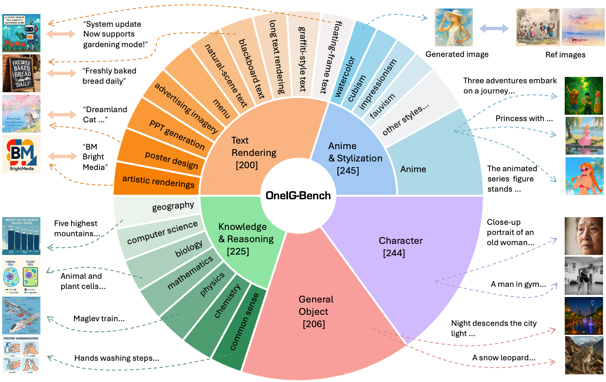

# OneIG-Benchmark: Omni-dimensional Nuanced Evaluation for Image Generation.

# Introduction

We introduce OneIG-Bench, a meticulously designed comprehensive benchmark framework for fine-grained evaluation of T2I models across multiple dimensions, including subject-element alignment, text rendering precision, reasoning-generated content, stylization, and diversity.

Key contribution:

- Present OneIG-Bench with 1120 carefully collected prompts, which can be used to extensively evaluate the performance of current text-to-image models.
- A systematic quantitative evaluation is developed to facilitate objective capability ranking through standardized metrics, enabling direct comparability across models.
- State-of-the-art open-sourced methods as well as the proprietary model are evaluated based on our proposed benchmark to facilitate the development of text-to-image research.
